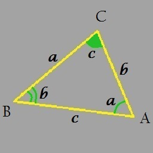

# ITGeometry
На вход программе подаются три стороны треугольника (AB, BC, AC).  

**Функции:**
1. Вычисление длин медиан
2. Вычисление длин биссектрисс
3. Высисление длин высот
4. Вычисление углов
5. Построение графика трегольника

**Установка для Windows** 
Скачайте файл *ITGeometry.exe* и запустите его.
